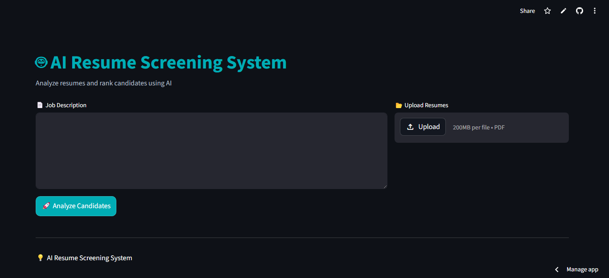
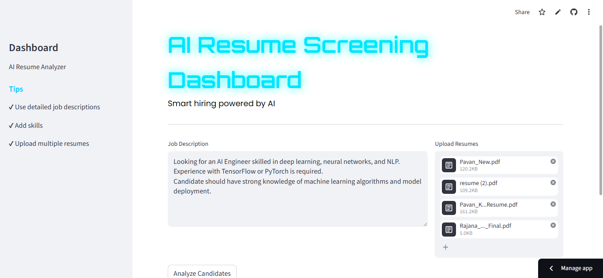
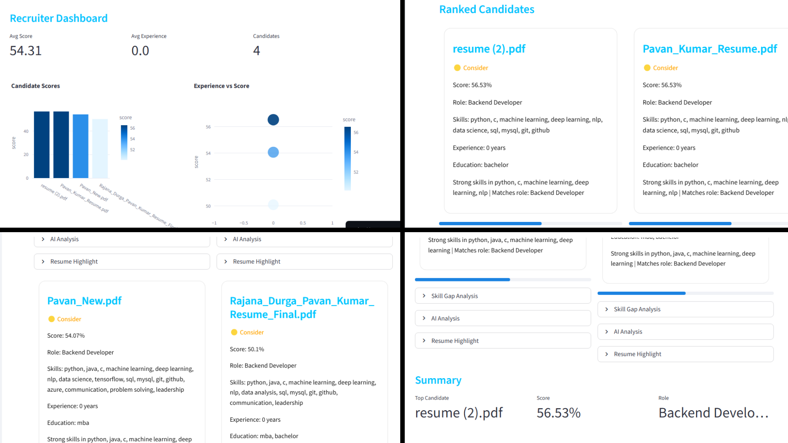

# 🤖 AI Resume Screening & Job Match System


An **AI-powered recruitment assistant** that analyzes resumes and ranks candidates based on job description relevance.

---

# 🚀 Project Overview

Recruiters receive hundreds of resumes for a single role. This system automates:

- 📄 Resume parsing (PDF)
- 🧹 Text preprocessing (NLP)
- 🛠 Skill extraction
- 🧠 Job role prediction
- 📊 Resume-job similarity scoring
- 🏆 Candidate ranking
---

# 🔥 Key Features

✅ Upload multiple resumes (PDF)

✅ Job description input

✅ Skill extraction

✅ TF-IDF vectorization

✅ Cosine similarity matching

✅ Job role prediction

✅ ATS scoring system

✅ Ranking dashboard

✅ Streamlit UI

---

# 🧠 How It Works

1. Enter job description  
2. Upload resumes  
3. System processes text using NLP  
4. Extracts skills  
5. Converts text → TF-IDF vectors  
6. Computes similarity  
7. Predicts job role  
8. Ranks candidates

---

# 🏗️ System Architecture

```
Job Description
      ↓
Resume Upload (PDF)
      ↓
PDF Parsing (PyMuPDF)
      ↓
Text Preprocessing
      ↓
Skill Extraction
      ↓
TF-IDF Vectorization
      ↓
Cosine Similarity
      ↓
Naive Bayes Prediction
      ↓
Ranking Output
```

---

| Layer                | Technology              |
| -------------------- | ----------------------- |
| Programming Language | Python                  |
| NLP                  | NLTK                    |
| Machine Learning     | Scikit-learn            |
| Model                | Multinomial Naive Bayes |
| Vectorization        | TF-IDF                  |
| Similarity Metric    | Cosine Similarity       |
| PDF Parsing          | PyMuPDF (fitz)          |
| Frontend             | Streamlit               |
| Data Processing      | Pandas                  |
| Model Persistence    | Pickle                  |
| UI Styling           | Custom CSS              |
---

# 📂 Project Structure

```
AI-Resume-Job-Match-System
│
├── app.py
├── config.py
├── requirements.txt
│
├── models/
│ ├── model.pkl
│ └── vectorizer.pkl
│ 
├── src/
│ ├── preprocess.py
│ ├── pdf_parser.py
│ ├── skill_extractor.py
│ ├── job_predictor.py
│ ├── similarity.py
│ └── train.py
│
├── utils/
│ └── helpers.py
│
├── data
│   ├── skills.txt
│   └── job_roles.csv
│
├── assets
│   ├── styles.css
│   └── screenshots
│       ├── home_v2.png
│       ├── upload_v2.png
│       └── results_v2.png
├── notebooks/
│   └──exploration.ipynb
└── README.md
```

---

# 📸 Application Preview

### 🖥️ Home Screen



---

### 📂 Resume Upload & Skill Detection



---

### 🏆 Resume Ranking & Job Role Prediction



---

# ▶️ How to Run

### 1. Clone Repository

```bash
git clone https://github.com/your-username/AI-Resume-Job-Match-System.git
cd AI-Resume-Job-Match-System
```

---

### 2. Install Requirements

```bash
pip install -r requirements.txt
```

---

### 3. Train Model

```bash
python src/train.py
```

---

### Run App

```bash
streamlit run app.py
```

Open:

```
http://localhost:8501
```

---

# Applications

This project can be used in:

🏢 HR Resume Screening Systems
🎓 University Placement Cells
🚀 Hiring Platforms
🤖 AI-powered Applicant Tracking Systems (ATS)
📊 Recruitment Automation Tools

---

# 🔮 Future Enhancements

* 📄 Advanced **PDF Resume Parsing**
* 🧠 **BERT-based Resume Matching**
* 🧾 **Named Entity Recognition (NER) Skill Extraction**
* 📊 Advanced **ATS Score Calculation**
* 👩‍💼 Recruiter **Analytics Dashboard**
* 🗄️ **Database Integration**
* ☁️ Cloud Deployment (Streamlit Cloud / Render)
* 🔐 **Authentication System**
* 📈 Resume **Skill Gap Analysis**

---

# 👨‍💻 Author

**Rajana Durga Pavan Kumar**

B.Tech – Computer Science & Engineering (AI & ML)
Institute of Technical Education and Research (ITER)
SOA University

GitHub
https://github.com/DurgaPavan0923

---

# 📜 License

This project is licensed under the **MIT License**.
